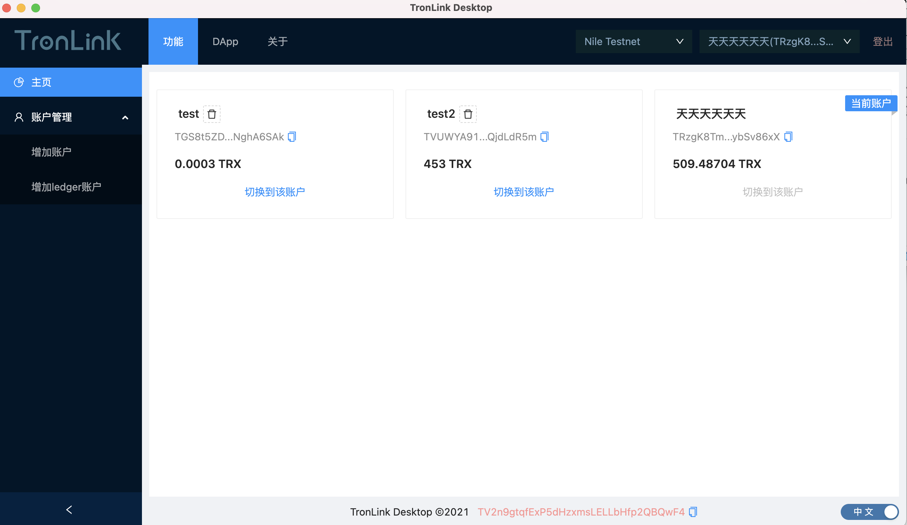
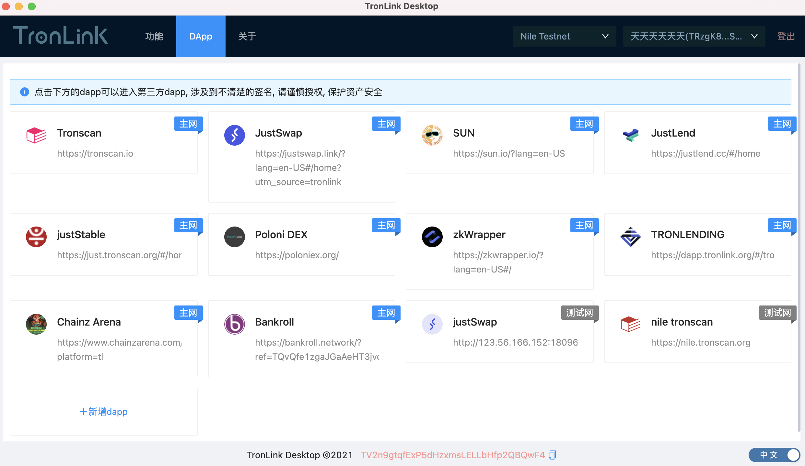
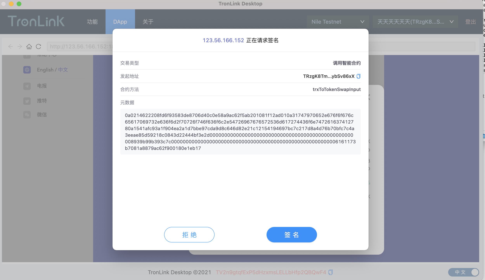

# TronLink-desktop

## 背景

由于 chrome91 之后通过 u2f 的协议不能直接连接 ledger 了, 如果浏览器扩展需要使用 ledger, 则必须使用 ledger live 这个软件来作为桥,然后才能使用 ledger 的相关功能. 故这里为了方便自己使用 ledger, 写了一个桌面级软件, 跳出浏览器限制, 直接使用 usb 或者蓝牙(需要 ledger 设备支持)来使用 ledger. 兼容 tronlink-extension 注入 dapp 的 tronweb 变量, 可以参考[tronLink 插件文档](https://cn.developers.tron.network/docs/%E4%BB%8B%E7%BB%8D-2)

第一次使用 electron 和 typescript,很多语法不太优雅,有很多的 any.

## todo

- [x] 登陆
- [x] 账户管理
- [x] 节点选择
- [x] Page Hook 注入
- [x] 签名模态框
- [x] webview 事件通知
- [x] 通过 usb 连接 ledger
- [x] 通过蓝牙连接 ledger
- [x] ledger 账户签名
- [x] kdf(scrypt)加密
- [x] 界面优化

## To Use

To clone and run this repository you'll need [Git](https://git-scm.com) and [Node.js](https://nodejs.org/en/download/) (which comes with [npm](http://npmjs.com)) installed on your computer. From your command line:

```bash
# Clone this repository
git clone https://github.com/sclihuiming/tronlink-desktop.git
# Go into the repository
cd tronlink-desktop
# Install dependencies
yarn install
# Run the app
yarn start
# package th app
yarn package
```

Note: If you're using Linux Bash for Windows, [see this guide](https://www.howtogeek.com/261575/how-to-run-graphical-linux-desktop-applications-from-windows-10s-bash-shell/) or use `node` from the command prompt.

## 界面图





## License

[CC0 1.0 (Public Domain)](LICENSE.md)
